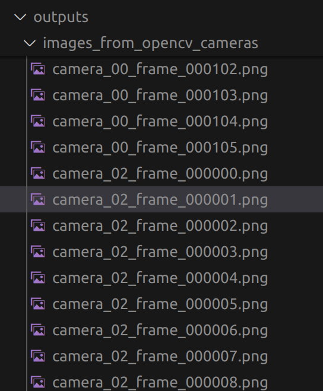

# 如何搭建具身智能Lerobot violin和cello机械臂并完成自定义抓取任务

[LeRobot](https://github.com/huggingface/lerobot/tree/main) 致力于为真实世界的机器人提供 PyTorch 中的模型、数据集和工具。其目标是降低机器人学的入门门槛，使每个人都能通过共享数据集和预训练模型进行贡献和受益。LeRobot 集成了经过验证的前沿方法，专注于模仿学习和强化学习。它提供了一套预训练模型、包含人类收集的示范数据集和仿真环境，使用户无需进行机器人组装即可开始使用。未来几周，计划在当前最具成本效益和性能的机器人上增强对真实世界机器人的支持。


##  产品介绍TODO

1. **开源 & 便于二次开发**
   本系列舵机由[华馨京科技](https://fashionrobo.com/)提供，是一套开源、便于二次开发的6+1自由度机器臂解决方案。
2. **支持 LeRobot 平台集成**
   专为与 [LeRobot 平台](https://github.com/huggingface/lerobot) 集成而设计。该平台提供 PyTorch 模型、数据集与工具，面向现实机器人任务的模仿学习（包括数据采集、仿真、训练与部署）。
3. **丰富的学习资源**TODO
   提供全面的开源学习资源，帮助用户快速上手并开发机器人应用。


## 特点内容TODO

- 自由度：拥有6+1自由度，抵达位置更广泛。
- 悬停按钮功能支持：悬停按钮可让LeaderArm随时悬停在任意角度。


## 规格参数TODO

|                      | Violin(Leader)                                               | Viola(Follower)                                              | Cello(Follower)                                              |
| -------------------- | ------------------------------------------------------------ | :----------------------------------------------------------- | :----------------------------------------------------------- |
| **推荐电源**         | DC 12V 10 A                                                  | DC 12V 10 A                                                  | DC 12V 25A                                                   |
| **电机构成**         | RX8-U50H-M x2 <br>RA8-U25H-M x5                              | RX8-U50H-M x2 <br/>RA8-U25H-M x5                             | RX18-U100H-M x3 <br/>RX8-U50H-M x4                           |
| **悬停**             | 通过手柄按钮实现                                             | 跟随Leader时可悬停                                           | 跟随Leader时可悬停                                           |
| **推荐工作温度范围** | 0 °C ～ 60 °C                                                | 0 °C ～ 60 °C                                                | 0 °C ～ 60 °C                                                |
| **关节范围**         | joint0:±135°<br>joint1:±90°<br/>joint2:±90°<br/>joint3:±135°<br/>joint4:±90°<br/>joint5:±135°<br/> | joint0:±135°<br/>joint1:±90°<br/>joint2:±90°<br/>joint3:±135°<br/>joint4:±90°<br/>joint5:±135°<br/> | joint0:±135°<br/>joint1:±90°<br/>joint2:±90°<br/>joint3:±135°<br/>joint4:±90°<br/>joint5:±135°<br/> |
| **夹爪行程**         | 0~70mm                                                       | 0~70mm                                                       | 0~70mm                                                       |

有关舵机更多资讯，请访问以下链接。

[RA8-U25H-M](https://fashionrobo.com/actuator-u25/23396/)

[RX18-U100H-M](https://fashionrobo.com/actuator-u100/22853/)

[RX8-U50H-M](https://fashionrobo.com/actuator-u50/136/)


## 初始环境搭建

For Ubuntu X86:

- Ubuntu 22.04
- CUDA 12+
- Python 3.13
- Troch 2.6


## 安装与调试

### 安装LeRobot

需要根据你的 CUDA 版本安装 pytorch 和 torchvision 等环境。

1. 安装 Miniconda： 对于 Jetson：

```bash
wget https://repo.anaconda.com/miniconda/Miniconda3-latest-Linux-aarch64.sh
chmod +x Miniconda3-latest-Linux-aarch64.sh
./Miniconda3-latest-Linux-aarch64.sh
source ~/.bashrc
```

或者，对于 X86 Ubuntu 22.04：

```bash
mkdir -p ~/miniconda3
cd miniconda3
wget https://repo.anaconda.com/miniconda/Miniconda3-latest-Linux-x86_64.sh -O ~/miniconda3/miniconda.sh
bash ~/miniconda3/miniconda.sh -b -u -p ~/miniconda3
rm ~/miniconda3/miniconda.sh
source ~/miniconda3/bin/activate
conda init --all
```

2.创建并激活一个新的 conda 环境用于 lerobot

```bash
conda create -y -n lerobot python=3.10 && conda activate lerobot
```

3.克隆 Lerobot 仓库：

```bash
https://github.com/servodevelop/lerobot-starai.git
```


4.使用 miniconda 时，在环境中安装 ffmpeg：

```bash
conda install ffmpeg -c conda-forge
```
这通常会为你的平台安装使用 libsvtav1 编码器编译的 ffmpeg 7.X。如果不支持 libsvtav1（可以通过 ffmpeg -encoders 查看支持的编码器），你可以：

- 【适用于所有平台】显式安装 ffmpeg 7.X：

```bash
conda install ffmpeg=7.1.1 -c conda-forge
```

5.安装带有 fashionstar 电机依赖的 LeRobot：

```bash
cd ~/lerobot && pip install -e ".[starai]"
```
重新安装

```bash
cd ~/lerobot && pip install -e ".[starai]"

pip install --only-binary :all: pynput
```

6.检查 Pytorch 和 Torchvision

由于通过 pip 安装 lerobot 环境时会卸载原有的 Pytorch 和 Torchvision 并安装 CPU 版本，因此需要在 Python 中进行检查。

```python
import torch
print(torch.cuda.is_available())
```

如果输出结果为 False，需要根据[官网教程](https://pytorch.org/index.html)重新安装 Pytorch 和 Torchvision。

### 机械臂开箱TODO

机械臂套装内包含

- leader arm
- follower arm
- 电源（12V 12.5A）x2
- 


### 手臂端口设置

在终端输入以下指令来找到两个机械臂对应的端口号：

```bash
python lerobot/scripts/find_motors_bus_port.py
```

例如：

1. 识别Leader时端口的示例输出（例如，在 Mac 上为 `/dev/tty.usbmodem575E0031751`，或在 Linux 上可能为 `/dev/ttyUSB0`） 
2. 识别Reader时端口的示例输出（例如，在 Mac 上为 `/dev/tty.usbmodem575E0032081`，或在 Linux 上可能为 `/dev/ttyUSB1`）

### 校准文件设置

通常情况下,机械臂出厂时已经完成校准，无须再次校准。如发现某关节电机长期处于限位处，可与厂家联系获取校准文件再次校准。


注意：如果识别不到ttyUSB0串口信息。

列出所有usb口。

```sh
lsusb
```


识别成功，查看ttyusb的信息

```sh
sudo dmesg | grep ttyUSB
```


最后一行显示断连，因为brltty在占用该USB设备号，移除掉就可以了

```sh
sudo apt remove brltty
```


最后，赋予权限

```sh
sudo chmod 666 /dev/ttyUSB0
```


## 遥操作

您已准备好遥操作您的机器人（不包括摄像头）！运行以下简单脚本：

```bash
python lerobot/scripts/control_robot.py \
  --robot.type=starai \
  --robot.cameras='{}' \
  --control.type=teleoperate
```

程序启动后，悬停按钮依旧生效。


## 添加摄像头

https://github.com/user-attachments/assets/7fb10a04-8cd7-4a28-922b-c362e5284e0c

在插入您的两个 USB 摄像头后，运行以下脚本以检查摄像头的端口号，切记摄像头避免插在USB Hub上，USB Hub速率太慢会导致读不到图像数据。

```bash
python lerobot/common/robot_devices/cameras/opencv.py \
    --images-dir outputs/images_from_opencv_cameras
```

终端将打印出以下信息。以我的笔记本为例，笔记本摄像头为index0，外接的USB摄像头为index2。

```markdown
Mac or X86 Ubuntu detected. Finding available camera indices through scanning all indices from 0 to 60
[...]
Camera found at index 0
Camera found at index 2
[...]
Connecting cameras
OpenCVCamera(0, fps=30.0, width=640, height=480, color_mode=rgb)
OpenCVCamera(2, fps=30.0, width=640, height=480, color_mode=rgb)
Saving images to outputs/images_from_opencv_cameras
Frame: 0000 Latency (ms): 39.52
[...]
Frame: 0046 Latency (ms): 40.07
Images have been saved to outputs/images_from_opencv_cameras
```

您可以在 `outputs/images_from_opencv_cameras` 目录中找到每个摄像头拍摄的图片，并确认不同位置摄像头对应的端口索引信息。然后，完成 `lerobot/lerobot/common/robot_devices/robots/configs.py` 文件中摄像头参数的对齐。

 

```
@RobotConfig.register_subclass("starai")
@dataclass
class StaraiRobotConfig(ManipulatorRobotConfig):
    calibration_dir: str = ".cache/calibration/starai"

    cameras: dict[str, CameraConfig] = field(
        default_factory=*lambda*: {
            "laptop": OpenCVCameraConfig(
                camera_index=2,             ##### UPDATE HEARE
                fps=30,
                width=640,
                height=480,
            ),
            "phone": OpenCVCameraConfig(
                camera_index=0,             ##### UPDATE HEARE
                fps=30,
                width=640,
                height=480,
            ),
        }
    )

​    mock: bool = False
  
```

然后，您将能够在遥操作时在计算机上显示摄像头：

```bash
python lerobot/scripts/control_robot.py \
  --robot.type=starai \
  --control.type=teleoperate \
  --control.display_data=true
```

## 数据集制作采集

https://github.com/user-attachments/assets/ff674777-a041-440a-b03e-77ed0ab43297

一旦您熟悉了遥操作，您就可以开始您的第一个数据集。

如果您想使用 Hugging Face Hub 的功能来上传您的数据集，并且您之前尚未这样做，请确保您已使用具有写入权限的令牌登录，该令牌可以从 [Hugging Face 设置](https://huggingface.co/settings/tokens) 中生成：

```bash
huggingface-cli login --token ${HUGGINGFACE_TOKEN} --add-to-git-credential
```

将您的 Hugging Face 仓库名称存储在一个变量中，以运行以下命令：

```bash
HF_USER=$(huggingface-cli whoami | head -n 1)
echo $HF_USER
```

记录 2 个回合并将您的数据集上传到 Hub：

```bash
python lerobot/scripts/control_robot.py \
  --robot.type=starai \
  --control.type=record \
  --control.fps=30 \
  --control.single_task="Grasp a lego block and put it in the bin." \
  --control.repo_id=${HF_USER}/starai \
  --control.tags='["starai","tutorial"]' \
  --control.warmup_time_s=5 \
  --control.episode_time_s=30 \
  --control.reset_time_s=30 \
  --control.num_episodes=20 \
  --control.display_data=true \
  --control.push_to_hub=false
```


> [!TIP]
>
> - 如果你希望将数据保存在本地（`--control.push_to_hub=false`），请将 `--control.repo_id=${HF_USER}/starai` 替换为一个自定义的本地文件夹名称，例如 `--control.repo_id=starai/starai。`数据将存储在系统主目录下的 `~/.cache/huggingface/lerobot`。
> - 如果你通过 `--control.push_to_hub=true` 将数据集上传到了 Hugging Face Hub，可以通过 [在线可视化你的数据集](https://huggingface.co/spaces/lerobot/visualize_dataset)，只需复制粘贴你的 repo id。
> - 注意：你可以通过添加 `--control.resume=true` 来继续录制。如果你还没有上传数据集，还需要添加 `--control.local_files_only=true`。
> - 在回合记录过程中任何时候按下右箭头 -> 可提前停止并进入重置状态。重置过程中同样，可提前停止并进入下一个回合记录。
> - 在录制或重置到早期阶段时，随时按左箭头 <- 可提前停止当前剧集，并重新录制。
> - 在录制过程中随时按 ESCAPE ESC 可提前结束会话，直接进入视频编码和数据集上传。
> - 一旦你熟悉了数据记录，你就可以创建一个更大的数据集进行训练。一个不错的起始任务是在不同的位置抓取物体并将其放入箱子中。我们建议至少记录 50 个场景，每个位置 10 个场景。保持相机固定，并在整个录制过程中保持一致的抓取行为。同时确保你正在操作的物体在相机视野中可见。一个很好的经验法则是，你应该仅通过查看相机图像就能完成这项任务。
> - 在接下来的章节中，你将训练你的神经网络。在实现可靠的抓取性能后，你可以在数据收集过程中引入更多变化，例如增加抓取位置、不同的抓取技巧以及改变相机位置。 
> - 避免快速添加过多变化，因为这可能会阻碍您的结果。
> - 在 Linux 上，如果在数据记录期间左右箭头键和 Esc 键没有效果，请确保您已设置 $DISPLAY 环境变量。参见 [pynput 限制](https://pynput.readthedocs.io/en/latest/limitations.html#linux)。


## 可视化数据集

数据集保存在本地，并且数据采集时运行超参数为 `--control.push_to_hub=false` ，您也可以使用以下命令在本地进行可视化：

```bash
python lerobot/scripts/visualize_dataset_html.py \
  --repo-id starai/starai_test \
```

这里的`starai`为采集数据时候自定义的repo_id名。


## 重播一个回合

```
python lerobot/scripts/control_robot.py \
  --robot.type=starai \
  --control.type=replay \
  --control.fps=30 \
  --control.repo_id=starai/starai \
  --control.episode=0
  --control.local_files_only=true
```


## 训练

要训练一个控制您机器人策略，使用 `python lerobot/scripts/train.py` 脚本。需要一些参数。以下是一个示例命令：

```bash
python lerobot/scripts/train.py \
  --dataset.repo_id=starai/starai \
  --policy.type=act \
  --output_dir=outputs/train/act_starai \
  --job_name=act_starai \
  --policy.device=cuda \
  --wandb.enable=false
```

如果你想训练本地数据集，repo_id与采集数据的repo_id对齐即可。训练应该需要几个小时。您将可以在 `outputs/train/act_starai_test/checkpoints` 中找到训练结果的权重文件。

要从某个检查点恢复训练，下面是一个从 `act_starai` 策略的最后一个检查点恢复训练的示例命令：

```bash
python lerobot/scripts/train.py \
  --config_path=outputs/train/act_starai_test/checkpoints/last/pretrained_model/train_config.json \
  --resume=true
```

## 评估

您可以使用 [`lerobot/scripts/control_robot.py`](https://github.com/huggingface/lerobot/blob/main/lerobot/scripts/control_robot.py) 中的 `record` 功能，但需要将策略训练结果权重作为输入。例如，运行以下命令记录 10 个评估回合：

```bash
python lerobot/scripts/control_robot.py \
  --robot.type=starai \
  --control.type=record \
  --control.fps=30 \
  --control.single_task="Grasp a lego block and put it in the bin." \
  --control.repo_id=starai/eval_act_starai \
  --control.tags='["tutorial"]' \
  --control.warmup_time_s=5 \
  --control.episode_time_s=30 \
  --control.reset_time_s=30 \
  --control.num_episodes=10 \
  --control.push_to_hub=false \
  --control.policy.path=outputs/train/act_so101_test/checkpoints/last/pretrained_model
```

如您所见，这几乎与之前用于记录训练数据集的命令相同。只有两处变化：

1. 增加了 `--control.policy.path` 参数，指示您的策略检查点的路径（例如 `outputs/train/eval_act_starai/checkpoints/last/pretrained_model`）。如果您将模型检查点上传到 Hub，也可以使用模型仓库（例如 `${HF_USER}/eval_act_starai`）。
2. 数据集的名称以 `eval` 开头，以反映您正在运行推理（例如 `${HF_USER}/eval_act_starai`）。

## FAQ

- 如果实用本文档教程，请git clone本文档推荐的github仓库`TODO`。

- 如果遇到以下报错，需要检查对应端口号的机械臂是否接通电源，总线舵机是否出现数据线松动或者脱落。

  ```bash
  ConnectionError: Read failed due to comunication eror on port /dev/ttyACM0 for group key Present_Position_Shoulder_pan_Shoulder_lift_elbow_flex_wrist_flex_wrist_roll_griper: [TxRxResult] There is no status packet!
  ```

  

- 如果你维修或者更换过机械臂零件，请完全删除`~/lerobot/.cache/huggingface/calibration/so100`文件夹并重新校准机械臂

- 如果遥操作正常，而带Camera的遥操作无法显示图像界面，请参考[这里](https://github.com/huggingface/lerobot/pull/757/files)

- 如果在数据集遥操作过程中出现libtiff的问题，请更新libtiff版本。

  ```bash
  conda install libtiff==4.5.0  #for Ubuntu 22.04 is libtiff==4.5.1
  ```

  

- 执行完[安装Lerobot](https://wiki.seeedstudio.com/cn/lerobot_so100m/#安装lerobot)可能会自动卸载gpu版本的pytorch，所以需要在手动安装torch-gpu。

- 对于Jetson，请先安装[Pytorch和Torchvsion](https://github.com/Seeed-Projects/reComputer-Jetson-for-Beginners/blob/main/3-Basic-Tools-and-Getting-Started/3.3-Pytorch-and-Tensorflow/README.md#installing-pytorch-on-recomputer-nvidia-jetson)再执行`conda install -y -c conda-forge ffmpeg`,否则编译torchvision的时候会出现ffmpeg版本不匹配的问题。

- 如果出现如下问题，是电脑的不支持此格式的视频编码，需要修改`lerobot/lerobot/common/datasets /video_utils.py`文件134行`vcodec: str = "libsvtav1"`的值修改为`libx264`或者`libopenh264`,不同电脑参数不同，可以进行尝试。 [Issues 705](https://github.com/huggingface/lerobot/issues/705)

  ```bash
  [vost#0:0 @ 0x13207240] Unknown encoder 'libsvtav1' [vost#0:0 @ 0x13207240] Error selecting an encoder Error opening output file /home/han/.cache/huggingface/lerobot/lyhhan/so100_test/videos/chunk-000/observation.images.laptop/episode_000000.mp4. Error opening output files: Encoder not found
  ```

  

- 重要的事！！！如果再执行过程中舵机的数据线松动，请恢复这个舵机到初始位置再重新链接舵机数据线，也可以通过[初始化舵机命令](https://wiki.seeedstudio.com/cn/lerobot_so100m/#校准舵机并组装机械臂)单独校准某个舵机，校准单独的舵机的时候确保舵机上只有一个数据线与驱动板相连。如果出现

  ```bash
  Auto-correct calibration of motor 'wrist roll' by shifting value by 1 full turns, from '-270 < -312.451171875 < 270degrees' to'-270<-312.451171875 < 270 degrees'.
  ```

  

  或者校准机械臂过程中的其他关于角度和超出限位值的报错，这个方法依然适用。

- 在3060的8G笔记本上训练ACT的50组数据的时间大概为6小时，在4090和A100的电脑上训练50组数据时间大概为2~3小时。

- 数据采集过程中要确保摄像头位置和角度和环境光线的稳定，并且减少摄像头采集到过多的不稳定背景和行人，否则部署的环境变化过大会导致机械臂无法正常抓取。

- 数据采集命令的num-episodes要确保采集数据足够，不可中途手动暂停，因为在数据采集结束后才会计算数据的均值和方差，这在训练中是必要的数据。

- 如果程序提示无法读取USB摄像头图像数据，请确保USB摄像头不是接在Hub上的，USB摄像头必须直接接入设备，确保图像传输速率快。

## 参考文档TODO

矽递科技英文Wiki文档：[How to use the SO10xArm robotic arm in Lerobot | Seeed Studio Wiki]([如何在 Lerobot 中使用 SO100/101Arm 机器人手臂 | Seeed Studio Wiki](https://wiki.seeedstudio.com/cn/lerobot_so100m/))

Huggingface Project:[Lerobot](https://github.com/huggingface/lerobot/tree/main)

ACT or ALOHA:[Learning Fine-Grained Bimanual Manipulation with Low-Cost Hardware](https://tonyzhaozh.github.io/aloha/)

VQ-BeT:[VQ-BeT: Behavior Generation with Latent Actions](https://sjlee.cc/vq-bet/)

Diffusion Policy:[Diffusion Policy](https://diffusion-policy.cs.columbia.edu/)

TD-MPC:[TD-MPC](https://www.nicklashansen.com/td-mpc/)
